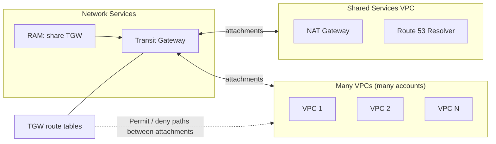

# Transit Gateway

## Overview
AWS Transit Gateway is a network transit hub used to interconnect VPCs and on-premises networks. 

Think of it as a cloud router at the center of your network — instead of connecting every VPC to every other VPC (a messy full-mesh), you connect each VPC once to the Transit Gateway and it handles all routing from that central point.

If we don't use the Transit Gateway we need to make the n*(n-1)/2 connection to make all the VPC connect to each other 

## Key Features
- Centralized connectivity management
- Simplified network architecture
- Support for inter-VPC and hybrid connectivity
- Route table management
- Multi-account and multi-region support

## Use Cases
- Hub-and-spoke network topology
- Large-scale VPC interconnection
- Hybrid cloud connectivity
- Simplified network management

## Benefits
- Reduced management complexity
- Cost savings compared to VPC peering
- Scalable network architecture
- Centralized security controls

## Implementation Considerations
- Transit Gateway attachment limits
- Route table configuration
- Cross-account sharing
- Monitoring and logging

## When to Use Transit Gateway vs VPC Peering

| Scenario | Use |
|---|---|
| 2–3 VPCs, simple connectivity | VPC Peering (cheaper) |
| 5+ VPCs that need to talk to each other | **Transit Gateway** |
| Multi-account, multi-region network | **Transit Gateway + RAM** |
| Need segmentation (prod vs dev routing) | **Transit Gateway** (route tables) |
| Hybrid connectivity (DC + many VPCs) | **Transit Gateway** (one DX/VPN to TGW) |
| Transitive routing required | **Transit Gateway** (peering is non-transitive) |

**Scenario:** A company has 50 VPCs across 3 AWS accounts in the same region. They need all VPCs to share a central DNS resolver and egress NAT gateway. The network team wants to manage routing from a single place. What is the MOST operationally efficient solution?

**Answer reasoning:** Deploy a Transit Gateway in the Network Services account → Share via AWS RAM to all accounts → Attach all VPCs → Place DNS resolver and NAT Gateway in a Shared Services VPC attached to the TGW → Use TGW route tables to control which VPCs can route where.

Implementation Diagram
