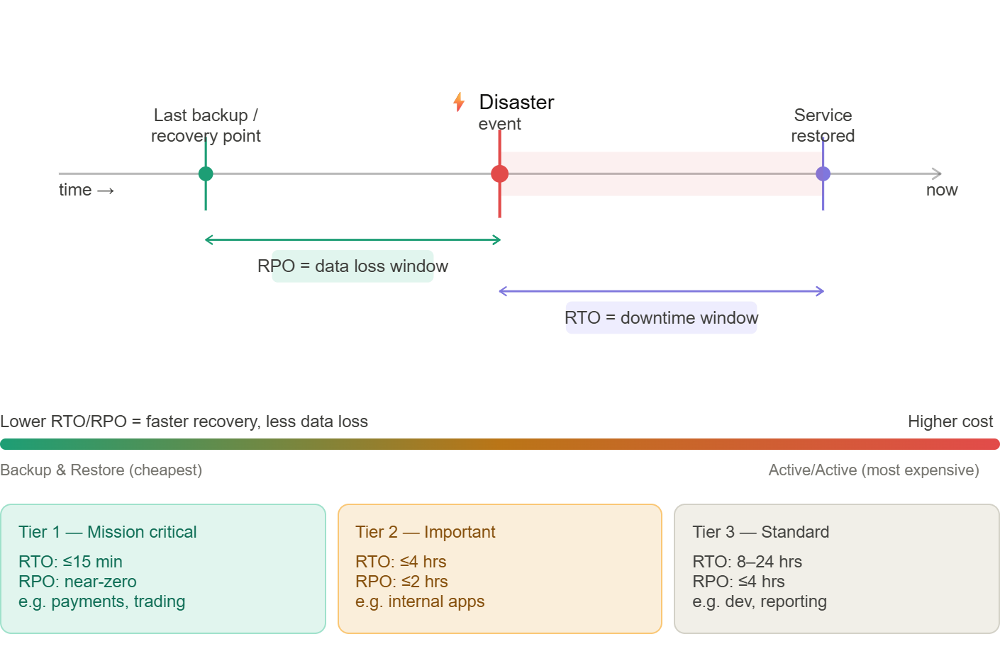

# RTO & RPO

## Overview

Recovery Time Objective (RTO) and Recovery Point Objective (RPO) are critical metrics for disaster recovery and business continuity planning.

  

## Recovery Time Objective (RTO)

RTO = how long can you be DOWN

### Definition

Recovery Time Objective (RTO) is the maximum acceptable delay between the interruption of service and restoration of service. This determines what is considered an acceptable time window when service is unavailable.

- Maximum acceptable downtime
- Time to recover operations
- Business impact measurement
- Service level agreement metric

### Factors Affecting RTO

- Business criticality
- Revenue impact
- Customer experience
- Regulatory requirements
- Operational complexity

### RTO Examples

- Critical systems: Minutes to hours
- Important systems: Hours to days
- Non-critical systems: Days to weeks

## Recovery Point Objective (RPO)

### Definition

Recovery Point Objective (RPO) is the maximum acceptable amount of time since the last data recovery point. This determines what is considered an acceptable loss of data between the last recovery point and the interruption of service.

- Maximum acceptable data loss
- Point in time for recovery
- Data loss tolerance
- Backup frequency measurement

### Factors Affecting RPO

- Data criticality
- Transaction volume
- Data change frequency
- Regulatory requirements
- Storage costs

### RPO Examples

- Real-time systems: Seconds to minutes
- Transactional systems: Minutes to hours
- Analytical systems: Hours to days

## RTO/RPO Matrix

| System Type       | Typical RTO               | Typical RPO       | Recommended Architecture   |
| ----------------- | ------------------------- | ----------------- | -------------------------- |
| Mission Critical  | Seconds – minutes         | Near-zero         | Multi-Region Active-Active |
| Business Critical | Minutes – < 1 hour        | Seconds – minutes | Warm Standby               |
| Important         | 1–4 hours                 | Minutes – hours   | Pilot Light                |
| Non-critical      | Several hours – 24+ hours | Hours             | Backup & Restore           |

## The Four AWS DR Strategies

The following strategies are listed in increasing order of complexity and descending order of RTO and RPO.

- Backup & Restore (RPO in hours, RTO in 24 hours or less): Back up data to services like S3, AWS Backup, or snapshots, then recreate infrastructure in the DR region when disaster occurs.
- Pilot Light (RPO in minutes, RTO in hours): A minimal version of the environment runs in DR (usually database replication only).
  Application servers are launched during recovery.
- Warm Standby (RPO in seconds, RTO in minutes): A scaled-down but fully functional stack runs continuously in the DR region and scales up during failover.
- Active-Active (RPO near-zero, RTO in seconds): Applications run simultaneously in multiple AWS Regions and actively serve traffic.

## Application Tiering — How Businesses Classify Workloads

- Tier 1 – Mission-critical
  - Applications that directly impact revenue or customer transactions.
  - Downtime or data loss must be extremely minimal.
  - Usually implemented using multi-region active-active or warm standby architectures.

- Tier 2 – Business-critical
  - Important for business operations but short outages are tolerable.
  - Often implemented using warm standby or pilot light DR strategies.

- Tier 3 – Standard / Non-critical
  - Systems where longer recovery times are acceptable.
  - Typically implemented using backup and restore strategies.

## Technology Considerations

### Database Solutions

- RDS Multi-AZ
- Aurora Global Database
- DynamoDB Global Tables
- Cross-region replication

### Storage Solutions

- S3 Cross-Region Replication
- EBS snapshots
- FSx for Windows
- Backup services

### Network Solutions

- Route 53 failover
- Global Accelerator
- Direct Connect
- VPN connections

## Best Practices

- Regular testing and validation
- Document recovery procedures
- Train response teams
- Monitor and alert on failures
- Review and update regularly

## Business Impact Analysis

- Identify critical systems
- Assess financial impact
- Evaluate customer impact
- Consider regulatory requirements
- Prioritize recovery efforts

## 💡 SAP-C02 Exam Question Pattern

**Scenario:** _A financial services company has a trading platform running in us-east-1. Their SLA mandates a maximum of 30 seconds of downtime and no more than 5 seconds of data loss. Cost is a secondary concern. What DR strategy should be implemented?_

**Answer reasoning:** 30-second RTO and 5-second RPO rule out Backup & Restore, Pilot Light, and Warm Standby. Only **Multi-Site Active/Active** achieves near-zero RTO and RPO. Implementation uses Aurora Global Database (sub-second replication), DynamoDB Global Tables, Route 53 latency-based routing or Global Accelerator, and identical stacks in two regions serving live traffic simultaneously.

The wrong answers will include "Warm Standby" — plausible but its RTO is minutes, not seconds — and "Pilot Light" which has RTO of hours.
